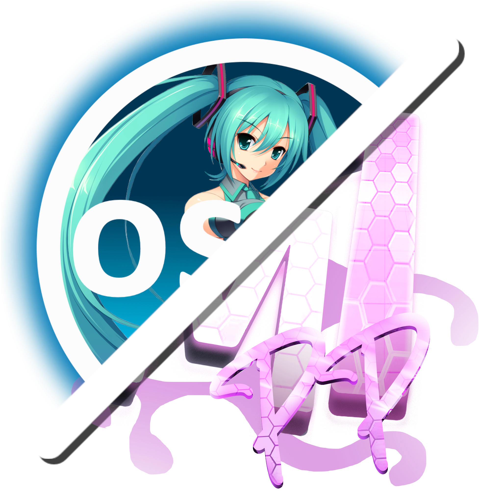

 

  

<h3 align="center">M1PP Launcher</h3>

  

    A simple osu! server launcher for M1PP & 4ayo 
     
  

## About The Project

**M1PP Launcher** is a custom launcher designed to simplify the process of setting up and playing osu! on the [M1PP](https://m1pposu.dev/) and [4ayo](https://4ayosu.ovh/) private servers.

It automates osu! installation, server configuration, and launching—all wrapped in a user-friendly interface.

Currently built only for **Windows**, with broader platform support planned for the future.

In addition to core setup features, the launcher includes **a manager for community-created mods**, making it easy to toggle and manage gameplay mods without editing files or launching injectors manually.

### Built With

[![Python][python-badge]][python-url]

[python-badge]: https://img.shields.io/badge/Python-3.11-blue?logo=python&logoColor=white
[python-url]: https://www.python.org/
[![NiceGUI][nicegui-badge]][nicegui-url]

[nicegui-badge]: https://img.shields.io/badge/NiceGUI-✨_UI_with_Python-45b8d8?logo=python&logoColor=white
[nicegui-url]: https://nicegui.io/

## Getting Started

To get a local copy up and running—and generate a standalone installer—follow these steps.
You'll be using `nicegui-pack` to bundle the app, and `NSIS` to create the installer for Windows.

### Windows Prerequisites

1. [Git for Windows](https://github.com/git-for-windows/git/releases/download/v2.49.0.windows.1/Git-2.49.0-64-bit.exe)
2. [Python 3.11.x](https://www.python.org/ftp/python/3.11.9/python-3.11.9-amd64.exe)
3. [MSYS2 (Follow the PyGObject install instructions)](https://pygobject.gnome.org/getting_started.html#windows-getting-started)
4. [NSIS 3 (For building the installer)](https://nsis.sourceforge.io/Download)
5. [.NET SDK 8.0.408](https://builds.dotnet.microsoft.com/dotnet/Sdk/8.0.408/dotnet-sdk-8.0.408-win-x64.exe)

### Building

### Windows
**In Windows PowerShell**
1. `git clone https://github.com/M1PPosuDEV/m1pplauncher.git`
2. `cd m1pplauncher`
3. `python -m venv venv`
4. `.\venv\Scripts\Activate.ps1`
5. `pip install -r requirements.txt`

**From now on, make sure you are using the MSYS2 UCRT64 shell**
1. Find the m1pplauncher folder and cd into it, often located in `C:/Users/YOUR_USER_NAME/m1pplauncher`
2. `source venv\Scripts\activate`
3. `pacman -S mingw-w64-ucrt-x86_64-python-pip mingw-w64-ucrt-x86_64-python-cairo mingw-w64-ucrt-x86_64-python-gobject mingw-w64-ucrt-x86_64-python-pywin32 mingw-w64-ucrt-x86_64-rust mingw-w64-ucrt-x86_64-rustup mingw-w64-ucrt-x86_64-python-psutil base-devel git mingw-w64-ucrt-x86_64-toolchain`
4. `rustup install stable-x86_64-pc-windows-gnu`
5. `rustup default stable-x86_64-pc-windows-gnu`
6. `pip install -r requirements-msys2.txt`
7. `sh build.sh`
8. `C:/Program\ Files\ \(x86\)/NSIS/Bin/makensis.exe install.nsi` (Installer, optional)

### Linux
1. `sudo apt-get install mono-complete git zenity` (adjust this to your distro's package manager)
2. `git clone https://github.com/M1PPosuDEV/m1pplauncher.git`
3. `cd m1pplauncher`
4. `python3 -m venv venv`
5. `source venv/bin/activate`
6. `pip install -r requirements-linux.txt`
7. `./build-linux.sh`

## Roadmap

- [ ] Adjustments to tosu pp calculation
- [ ] Discord Rich Presence support
- [ ] In-Launcher logging in
- [ ] osu!rx patcher rework
- [ ] osu!trainer mod
- [x] Multi-Platform support

See the [open issues](https://github.com/github_username/repo_name/issues) for a full list of proposed features (and known issues).

## Contributing

Contributions are what make the open source community such an amazing place to learn, inspire, and create. Any contributions you make are **greatly appreciated**.

If you have a suggestion that would make this better, please fork the repo and create a pull request. You can also simply open an issue with the tag "enhancement".
Don't forget to give the project a star! Thanks again!

## License

This project is licensed under the **GNU General Public License v3.0**. See `LICENSE.txt` for more information.

## Contacthttps://github.com/jbevain/cecil](https://github.com/M1PPosuDEV/m1pplauncher)

Join our [Discord](https://dsc.gg/m1ppand4ayo)

## Credits

[README Template](https://github.com/othneildrew/Best-README-Template)
[Mono.Cecil](https://github.com/jbevain/cecil)
[M1PP Launcherl](https://github.com/M1PPosuDEV/m1pplauncher)
